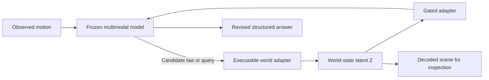
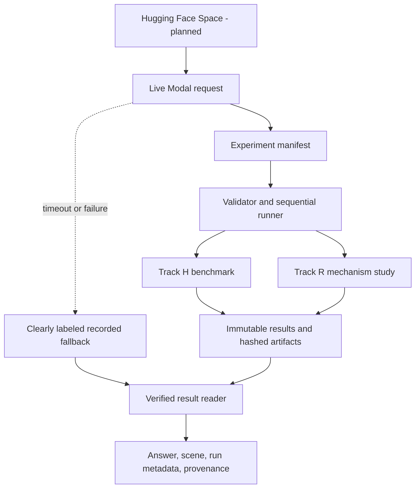

# JUMP Research

**Give an AI a theory. Let it run the thought experiment. Watch what happens when the world proves it wrong.**

JUMP gives an AI a small physics simulator it can use like a calculator for thought experiments. Instead of asking the model to imagine motion one word at a time, a user chooses a supported candidate law, starting scene, and what-if change, and JUMP executes the law to show what it predicts.

The planned system turns that prediction into a compact world state, gives the same state back to the language model, and can decode it into a visible scene for the user. This creates a run-and-inspect loop—a scientific REPL—for testing whether the model can notice that its first explanation fails and propose a better one.

> **Status — 13 August 2026:** JUMP is unfinished. It is being developed as a research instrument and AO Agents Hackathon submission. This repository reports no scientific result, no passed behavioral or mechanistic model gate, and no public model release. A secured engineering endpoint exists, but no Hugging Face Space is currently available.

## The challenge behind JUMP

In the 2026 position paper [*LLMs can't jump*](https://philsci-archive.pitt.edu/28024/) ([PDF](https://philsci-archive.pitt.edu/28024/1/Scientific_Invention_Position_Paper%20%2817%29.pdf)), [Tom Zahavy](https://www.tomzahavy.com/projects/llms-cant-jump) separates three kinds of inference. Induction finds a rule in observed cases. Deduction works out what follows from a given rule. Abduction proposes a new explanatory premise for a surprising result. Zahavy's position is that current generative AI is strong at induction and increasingly capable at deduction, but lacks the mechanism for the abductive jump required to formulate new scientific premises.

The paper points to physically consistent, interactive world models as one possible route from sensory experience to formal explanation. JUMP takes that proposal as a research prompt, not as an established result.

## The question JUMP asks

JUMP does **not** claim to refute Zahavy's paper, reproduce scientific invention, or test a model's ability to invent a theory such as General Relativity. It asks a much smaller empirical question:

> Can an executable, physically consistent counterfactual-world representation help a frozen multimodal language model abandon a falsified rule and propose the correct hidden-variable replacement in a controlled synthetic world?

The project does not ask the model to discover real physics. It uses deliberately small, generated worlds so the proposed law, hidden variables, and correct answer are all known in advance.

## A concrete test: six moving dots

One benchmark shows six identical dots moving on a 2D canvas. Each dot stands for a test particle. The simulator secretly assigns every dot one of two types—think of identical-looking particles whose hidden category changes how they interact. The model sees positions and motion, but not those type labels. Whether two dots attract or repel depends on whether their hidden types match, and the strength of the force follows one rule from a small fixed set.

The model first commits to an explanation of the motion. JUMP then executes that explanation and compares its predicted world with what was observed. If the two disagree, the model must decide whether the old rule is merely noisy or whether it needs a new hidden property. A correct answer identifies which dots belong together and which force law explains their movement. Because the simulator created the world, JUMP can score both parts exactly rather than asking another language model to judge the prose.

Six is not a scientific claim or a special physical number. It keeps the demo readable and the answer space small enough to check exhaustively: there are 31 non-trivial two-group assignments after treating a global label swap as the same answer.

### Planned live experience

The primary product path is a real Modal-backed run. The visitor sees the model's initial prediction, the executed thought experiment, the conflicting evidence, the decoded world state, and the revised structured answer. The interface also shows the run identity, revisions, timing, and artifact hashes. If the live request fails, it reports the failure before offering a clearly labeled recording; it never presents a recording as a new run.

The three scoped flows are a matched World A/World B latent swap, a falsified-prior sequence, and hidden-law discovery. JUMP refuses unrelated requests. It is a bounded synthetic-physics instrument, not a general scientific assistant.

## What works today—and what does not

- `origin/main` contains the manifest validator, sequential local/Modal runner, immutable result handling, exact six-object scoring, and CPU mechanistic test primitives.
- A small world-module training path has completed bounded remote engineering runs, with a private hash-verified Hugging Face artifact. This is infrastructure evidence, not a Gemma or mechanism result.
- A recovered real Gemma pilot reached terminal runner status `PASS`. For the primary row, evaluation loss was `2.437896` and token accuracy was `0.530303`, but `0/4` held-out answers parsed under the exact JSON contract. `PASS` therefore means the job completed; it is not a passed behavioral gate. Adapter-only artifacts are verified in a private repository; public release and inference validation remain pending.
- The rows labeled `no-hidden` and `permuted` in that smoke are text ablations, not the PRD-locked training controls, and provide no G3 evidence.
- A scaled Stage B run trained an observation-only encoder and learned decoder and ended with terminal status `PASS`. This is predictive engineering evidence only: it is one run, does not meet G2, and does not show that Gemma used the learned state.
- A secured endpoint has been verified for a separate world-state-supplied answer path. No public adapter or Hugging Face Space is available.

## Why the benchmark and provenance matter

A plausible answer does not reveal why it changed. Improvement could come from adapter training, extra parameters, simulator text, prompt format, or overfitting to this law family. JUMP therefore uses an exact JSON scorer rather than an LLM judge, matched controls rather than an anecdotal chat, and immutable artifacts rather than screenshots alone.

Provenance badges have a deliberately narrow meaning: the displayed bytes match the sealed run. A matching hash does not show that the language model used the decoded feature, and a successful swap does not by itself establish a model-internal mechanism. Track H tests the benchmark and product behavior; Track R reserves causal and mechanistic language for later intervention gates.

## Executable hypothesis

JUMP compares ordinary model inputs with a learned world-state latent supplied through a gated residual-stream adapter while the base model remains frozen. The model proposes a candidate law or query; the external world adapter executes it and returns a compact counterfactual state.



The central counterfactual test constructs World A and World B with the same visible prefix, nuisance variables, candidate laws, and prompt length but different hidden partitions and consequences. Each recipient is evaluated with its own latent, the matched donor latent, and control latents. If an A→B transplant shifts B's structured answer toward A's target, that is a **swap demonstration**. It does not by itself show that the latent caused theory revision or identify a model-internal mechanism.

Answers use an exact JSON contract rather than an LLM judge: a six-bit partition (canonicalized up to global label swap), a categorical replacement law, an adequacy Boolean, declared-horizon force vectors, and confidence in `[0,1]`. The principal planned comparisons are true latent E against scrambled/random latent G, simulator-as-text C′, same-parameter control I, no-hidden-structure training, and permuted episode–latent training. B−E is reported even when unfavorable.

## AO Agents Hackathon product

The product submission is a **bounded conversational interface to live synthetic-physics thought experiments executed on Modal**. It is for evaluators and research engineers who want to inspect the constructed experiment, follow the run, and verify the evidence behind the answer. Recorded artifacts exist only as a labeled emergency fallback. JUMP is not a general scientific assistant.

### Intended user experience

1. The visitor opens the Hugging Face Space, chooses a supported experiment, and starts a real Modal-backed model execution. This is the primary path.
2. The supported choices are three template-matched flows:
   - **World A ↔ World B Latent Swap:** compare a recipient world's own latent with a matched donor latent. This is the required Track H demonstration.
   - **The Falsified Prior:** show the sequence from committed prediction through contradictory evidence, adequacy decision, and structured replacement at T1–T4. This is a benchmark readout, not localization evidence.
   - **Hidden Law Discovery:** infer the hidden partition and force law from observed motion. This is stretch work because the selected checkpoint may saturate or floor on the task.
3. While Modal runs, the interface shows real progress rather than a simulated typing state. The final view identifies the run ID, model and tokenizer revisions, code/manifest revision, elapsed time, and whether the result came from the live path.
4. The interface shows the synthetic scene or diagnostic decoded scene beside the structured answer and an “Experiment JUMP constructed” card. Hidden types are not drawn because they are the target of inference.
5. A provenance panel displays hashes for the sealed run artifact, injected latent, decoder input, answer, and image. A badge may say only that the bytes match; a decoded image is not evidence that the language model used the represented feature.
6. If the live request times out or fails, the UI reports that failure first and may then offer a previously sealed artifact as **RECORDED FALLBACK — NOT THIS LIVE RUN**. It never silently substitutes recorded output for live output.
7. Requests outside synthetic 2D dynamics are refused or redirected to the three supported flows. Uploads, open-ended domain routing, persistent conversations, and real-world medical, scientific, or safety advice are out of scope.

The honest demo path is therefore: open the Space, start the swap experiment, follow the Modal job, inspect its run ID, revisions, and timing, compare the answers and decoded scenes, and verify the sealed provenance. If the live run fails, the demo shows the error before offering a clearly labeled recorded artifact. Live execution may be enabled only after rate limiting, checkpoint access, and license checks pass.

AO is relevant to how the submission is built, not to the scientific claim. Separate workers own the benchmark, UI, shared evidence seam, and independent mechanistic cross-check. Versioned artifacts and explicit ownership boundaries let those branches integrate without letting presentation code recalculate gates or upgrade claim language. The repository does not contain the hackathon's official rules or judging criteria; rule verification remains a pre-submission gate.

## Claim boundary: Track H versus Track R

| | Track H — hackathon benchmark and instrument | Track R — post-event mechanism study |
|---|---|---|
| Delivery horizon | Hackathon submission | Post-event research program |
| Intended deliverable | Deterministic simulator and scorer, A/B/C/C′ baselines, one world module and adapter path, matched swap demonstration, live-first Space with explicit recorded fallback | Event-aligned capture, probes, controlled ablation/injection, interventional mediation, OOD tests, second-checkpoint replication |
| Permitted evidence statement | A named, completed live run produced a benchmark readout or hash-verified swap in the tested episode/setting; a fallback may be described only as a replay of its original recorded run | Only the conclusion licensed by the last gate passed, bounded to tested checkpoints, sites, law families, and sampling settings |
| Forbidden statement | “Causal proof,” model-internal mechanism, localization, mediation, general scientific-assistant capability | General mediation/mechanism language without G8; generality without G7; any conclusion inferred from fixture data or a failed/unevaluated gate |

Track H tests the behavioral regime and injection/swap hypothesis only. Track R is where necessity, sufficiency, mediation, OOD retention, and replication are tested. A Track H demonstration cannot inherit Track R terminology merely because both use the same runner or swap primitive.

## System and repository architecture



| Path | Role on `origin/main` |
|---|---|
| [`src/jump_runner/`](src/jump_runner/) | Manifest validation, serial local/Modal execution, retry/resume, immutable results, gate stopping, secret boundaries, and hardware authorization |
| [`src/jump_mechanistic/`](src/jump_mechanistic/) | CPU-first activation, scoring, probe, swap, intervention, bootstrap, replication, and hardware-selection primitives exercised by a synthetic fixture |
| [`schemas/`](schemas/) | Normative `jump.experiments/v1` manifest and `jump.run-result/v1` result schemas |
| [`examples/`](examples/) | Local protocol/mechanistic smoke manifests plus locked GPU-profile and H100-escalation examples |
| [`tests/`](tests/) | Contract, immutability, retry, allowlist, gate, secret-redaction, Modal-boundary, hardware, scoring, and synthetic integration tests |
| [`docs/JUMP_PRD.md`](docs/JUMP_PRD.md) | Primary experiment specification and G0–G8 claim gates |
| [`docs/EXPERIMENT_AUTOMATION.md`](docs/EXPERIMENT_AUTOMATION.md) | Operator workflow, durable layout, secrets, and GPU escalation policy |

### Implementation status

The distinction below is part of the result, not project-management decoration.

**Merged on `origin/main` (`1de58e2`):**

- versioned manifest/result schemas and a fail-closed validator;
- serial execution with immutable attempts, retry/resume, phase dependencies, result hashing, and smoke/full namespace separation;
- Modal controller/worker boundaries with one worker at a time, narrowly mounted named secrets, log redaction, and CPU/T4/L4/A10/L40S/A100-80GB/H100 resource functions;
- allowlisted activation records, exact six-object scoring, held-out/OOD probe primitives, matched swaps, intervention controls, clustered bootstrap utilities, G6–G8 gate arithmetic, second-checkpoint identity checks, and evidence-gated H100 materialization;
- deterministic CPU smoke fixtures and tests for the above.

**Open or active work, not merged and not evidence:**

- [PR #5: mechanistic cross-check](https://github.com/perfect7613/jump-research/pull/5) documents blockers that must be fixed before confirmatory GPU work: no T0–T4 sentinel alignment, no computed G1/G3/G5 evaluators, missing cross-fitting/nested CV/AUC intervals/BH-FDR, observational OLS rather than the locked clamp/patch mediation estimator, layer-allowlist drift, incomplete sham/control handling, and a control-world scoring edge case.
- [PR #6: shared task-evidence seam](https://github.com/perfect7613/jump-research/pull/6) proposes content-addressed producer, executor, and verified-reader interfaces. It is intended to land before benchmark and UI integration; it is not present on `origin/main`.
- The active Track H foundation implements a deterministic six-object simulator, SVG renderer, exact scorer, A/B/C/C′ request interfaces, and a small world-dynamics training smoke. Earlier UI work defines sealed recorded conversations, provenance checks, refusal behavior, and the three flows above.
- Live-first Modal integration—including real progress, run metadata, sealed live results, timeout/failure handling, and explicit fallback selection—is active work. It is not implemented on `origin/main`, and no PR or deployment has yet been verified for this README. The live-first direction supersedes cached-first product wording in the current planning documents, which still require reconciliation; it does not relax their access, safety, provenance, or claim gates.
- A scoreable frozen-Gemma behavioral baseline, a validated latent adapter, a passed two-seed swap gate, a deployed Space, a verified learned-latent inference endpoint, a confirmatory manifest, and any Track R result remain unreported. Recorded development fixtures are not model results.

### Latest verified remote status

- **World-module execution:** an H100 one-step infrastructure smoke and a subsequent 120-step, three-seed pilot completed through the bounded Modal training path. The pilot met the planned NRMSE-improvement direction in all three seeds, but **full G2 is false**: hidden-relation probe AUC and its confidence bound were not measured, and the analytic basis supplies the hidden relation and force-law structure. These runs are Track H engineering evidence, not a Gemma result or mechanistic evidence.
- **Authentic learned-`z` Stage B:** Modal call `fc-01KZX0M7Q1XCW1AZDK98A8Z3RH` reached terminal status `PASS` at code `d910b73` under manifest `17f01188…e94`. An observation-only encoder mapped four frames of six particles' positions and velocities to a 16-value state; a learned decoder predicted future positions for 32 examples from a held-out law family. The sealed artifacts and tensor hashes verified. This is one scaled predictive engineering run. It does not meet G2's three-seed and relation-probe requirements, and it provides no Gemma behavioral, swap, intervention, causal, or mechanistic evidence. Its recorded evidence is in open PR #8, not `origin/main`.
- **Hugging Face artifact:** the complete private repository [`Perfect7613/jump-world-model`](https://huggingface.co/Perfect7613/jump-world-model) was inspected at immutable revision [`8f42ffda`](https://huggingface.co/Perfect7613/jump-world-model/tree/8f42ffda428daccffb02c9752f12e4bf4f7a6206). Its outer `SHA256SUMS` verifies every published file. Access currently requires authorization; this is not a public submission link. The repository contains one-scalar world-module weights and execution records, not Gemma weights, a latent adapter, or a general world model.
- **Frozen-Gemma adapter smoke:** recovery call `fc-01KZW1WH56JJCZ91R2366MXFW8` completed at code `510fd31` under manifest `6360ccb6…312a`. It exercised one optimization step for rows labeled `primary`, `no-hidden`, and `permuted` while keeping the base model frozen. The latter two are text ablations, not the PRD-locked no-hidden-world training and episode–latent permutation controls. They are not G3 evidence. The smoke's own flags are `behavioral=false` and `mechanistic=false`; it verifies plumbing, not usefulness.
- **Real Gemma pilot:** the recovered pilot reached terminal runner status `PASS`. The primary row recorded evaluation loss `2.437896` and answer-token accuracy `0.530303`, but none of four held-out answers parsed as complete JSON. The two secondary rows are text ablations, not G3 controls. This is a completed training run with a failed structured-output evaluation—not a behavioral or mechanistic result.
- **Private adapter artifact:** authenticated inspection verified the adapter-only repository [`Perfect7613/jump-gemma-adapter`](https://huggingface.co/Perfect7613/jump-gemma-adapter) at immutable revision [`17319321`](https://huggingface.co/Perfect7613/jump-gemma-adapter/tree/17319321cc9838eed0c348a46319c38320076fc2). It contains adapter-only run artifacts and live-contract records; it excludes base weights. The repository is private, is not a release, and its primary pilot is not demo-ready.
- **Secured engineering endpoint:** a sealed end-to-end check verified the world-state-supplied structured-answer path. That path includes the true partition as a prompt descriptor and renders deterministic simulator SVGs. Its “world swap” and falsified-prior flows select fixed held-out rows; they do not infer hidden types from pixels, decode a learned internal state, transplant a learned latent, or perform an intervention. No Hugging Face Space is currently available.

This section changes only when immutable runner evidence has been inspected. “Published,” “deployed,” and “shipped” additionally require inspection of the corresponding Hugging Face or endpoint identity. A running job is not reported as a result.

## Gates and failure conditions

### Track H release gates

| Gate | Pass condition | Failure action |
|---|---|---|
| G-H1 — preflight | Exact checkpoint license read, hackathon rules confirmed, and checkpoint accessible from Modal | Re-plan before model work; do not infer access or license from public metadata alone |
| G-H2 — Day 1 behavior | A/B/C/C′ yield scoreable pilot outputs | If C/C′ saturate, change the question to how injected state is used; do not claim enabled discovery |
| G-H3 — live submission path | One end-to-end Modal model execution exposes genuine progress and returns sealed output with run ID, revisions, timing, and provenance; timeout/failure fallback is visibly labeled | Without a verified live run, disclose that the submission is fallback-only; never present recorded output as a current execution |
| G-H4 — swap demonstration | Matched A/B swap reproduces on at least two seeds and provenance hash equality is 100% | Ship benchmark/baselines and state that injection transfer is not established; the demo recording may be blocked |

Independent hard stops apply even if the schedule gate is green: no causal or mechanistic Track H claim; no unrestricted metered chat; no general-assistant framing; no derived checkpoint before license confirmation; no server-side conversation persistence; and no provenance badge on a hash mismatch.

### Track R scientific gates

<details>
<summary>Show the exact G0–G8 criteria and stopping rules</summary>

All intervals below are the preregistered clustered intervals; confirmatory paired and mediation intervals use exactly 10,000 episode/world-seed resamples. A pivot creates a new manifest lineage and exploratory label. It never edits the locked confirmatory record.

| Gate | Pass condition | Pivot or claim-kill condition |
|---|---|---|
| G0 — preflight | License/access, hooks, scorer, schemas, resume, and a small smoke pass; accelerated hardware also needs measured evidence and approval | Re-plan checkpoint, hardware, or scope; no launch while any authorization or evidence is unresolved |
| G1 — regime | Frozen joint accuracy is 20–70% and parse success is ≥95% | Saturation → study state use; floor → one ontology-supplied pivot; otherwise end the discovery claim |
| G2 — world model | Across three seeds, rollout NRMSE improves ≥20% over persistence and relation AUC is ≥0.75 with lower CI >0.50 | Allow one horizon/bottleneck pivot; if both still fail, stop adapter/mechanism work |
| G3 — injection | E exceeds G, I, and both training controls by ≥5 percentage points with lower CI >0; exceeds C′ by ≥3 points with lower CI >0; swap success ≥65% with lower CI >50%; provenance 100% | E equivalent to C′ → benchmark/interface-engineering result only; failure against latent/training controls ends the latent-specific claim |
| G4 — localization | Inadequacy AUC ≥0.75 at T2/T3 with lower CI >0.50, T1→T2 rise ≥0.10, FDR pass, generic-error superiority, and promotion threshold at T4 | One probe only → report a correlate; a missing chain component cannot enter mediation |
| G5 — intervention | Ablation and injection each change the outcome ≥5 points with lower CI >0, beat every matched control, and add <2 points parse failure | One direction → necessity-only or sufficiency-only; neither → end the causal claim |
| G6 — mediation | TE lower CI >0; both ordered NIE lower CIs >0; mediated proportion ≥20%; specificity controls null or smaller | Report interventions without a mediation-chain claim |
| G7 — OOD | OOD causal-effect lower CI >0, retention ≥50%, provenance 100% | Report a law-family-specific result; reversal forbids general mechanism language |
| G8 — replication | A meaningfully different checkpoint passes G3/G5, NIE lower CI >0, mediated proportion ≥20%, OOD-effect lower CI >0, and retention ≥50% | Publish a checkpoint-specific result or null; no general mediation claim |

The current code is not sufficient to run these as a confirmatory chain. In particular, PR #5 finds that the implemented mediation helper is correlational, G3/G5 enter part of the chain as trusted Boolean inputs, and the real token-aligned capture path is absent. CPU engineering precedes GPU collection.

</details>

## Reproducible local workflow

Requirements: Python 3.10+ and a clean environment. These commands use deterministic local fixtures and make no remote call.

```bash
python -m venv .venv
source .venv/bin/activate
python -m pip install --upgrade pip
python -m pip install -e '.[test]'

pytest
jump-experiments plan examples/smoke-manifest.yaml --smoke
jump-experiments dry-run examples/smoke-manifest.yaml --smoke
jump-experiments run-local examples/smoke-manifest.yaml \
  --smoke --runs-dir /tmp/jump-runs
jump-experiments status examples/smoke-manifest.yaml \
  --smoke --runs-dir /tmp/jump-runs

jump-experiments run-local examples/mechanistic-synthetic.manifest.json \
  --smoke --runs-dir /tmp/jump-mechanistic
```

`run-local` refuses non-smoke execution. The synthetic mechanistic run verifies capture/scoring/probe/intervention/result wiring; its metric names and values must not be quoted as scientific evidence.

## Modal workflow and safety posture

Read [`docs/EXPERIMENT_AUTOMATION.md`](docs/EXPERIMENT_AUTOMATION.md) before using Modal. The runner is sequential rather than a sweep launcher: a failed run or phase gate stops downstream work, completed runs are not repeated, retries create immutable numbered attempts, and a global lease permits one worker across resource classes.

### Remote protocol smoke

The checked-in smoke manifest is the only ready remote example. It exercises the runner protocol, not a model or the product live path.

```bash
source .venv/bin/activate
python -m pip install -e '.[modal]'
pytest
jump-experiments dry-run examples/smoke-manifest.yaml --smoke

modal --version
modal profile current                 # identity/profile only; do not print tokens
modal deploy -m jump_runner.modal_app
modal run -m jump_runner.modal_app::submit \
  --manifest-path examples/smoke-manifest.yaml --smoke
modal run -m jump_runner.modal_app::status \
  --manifest-path examples/smoke-manifest.yaml --smoke
```

Do not launch this merely to reproduce local tests. Before any model-training or capture job, record G0: authenticated execution identity, exact checkpoint revision and license decision, real hook path, artifact/resume behavior, and resource limits. The planned order is CPU data/scoring and frozen baselines first; then one small hook/training smoke with the real context, batch shape, and hook set but fewer episodes; only then a gated larger run.

### Live product execution (active work)

The intended Space integration must use the same authorized runner boundary rather than a separate untracked inference call:

1. the server selects an allowlisted experiment template, validates it, and requests one rate-limited Modal execution;
2. the Space displays the assigned call/run identity and progress derived from runner state—never a fabricated percentage or typing animation;
3. success is displayed only after the immutable result and declared artifacts verify; the UI reads model/tokenizer, code, and manifest revisions plus timing from that evidence rather than client-supplied labels;
4. timeout or failure preserves and displays the failed live identity and error state before any recorded fallback is offered;
5. the fallback is read through the same verified artifact interface, retains its original run identity and timestamp, and is visually marked as unrelated to the failed live attempt.

This Space integration is not present on `origin/main`, and no Space is currently available. The verified secured endpoint is a narrower engineering path: the prompt supplies the true world-state partition, the SVG comes from the deterministic simulator, and the presets select fixed held-out rows. It is not the learned-`z` Stage B path or a learned-latent swap. Until the Space and learned-latent inference path are independently verified, “live-first” describes the required submission behavior rather than an available product.

### Planned training sequence

No real-model training task is merged on `origin/main`. The active Track H branch adds a 45-second, single-attempt T4-GPU smoke that pins PyTorch, requires CUDA, and fails rather than falling back to CPU. That smoke learns one force-scale parameter over an analytic hidden-relation basis; it checks optimization, checkpoint, and GPU plumbing, not a complete learned latent dynamics module or Gemma adapter.

The intended progression after the relevant branches merge is:

1. generate and exact-score the CPU benchmark, then run frozen-model A/B/C/C′ pilots before writing or training the adapter;
2. train the dynamics module on disjoint world seeds and stop unless G2 passes across three seeds;
3. freeze the base checkpoint, lock the adapter objective before training, and train only the gated adapter; task-loss training must be disclosed and accompanied by no-hidden-structure and permuted-pair controls;
4. evaluate E/G/C′/I/training controls and matched swaps before sealing any live or fallback product artifact;
5. seal only results whose manifest, checkpoint, latent, decoder input, answer, and image pass their required checks.

Training checkpoints must include optimizer/scheduler state where applicable, RNG state, and the data cursor so the next immutable attempt can resume without silently changing sample order. Model weights and checkpoints belong in the authorized Modal volume and, if release gates later pass, a versioned Hugging Face model repository—not in Git.

### Remote execution safeguards

- A smoke submission selects only runs marked `smoke_test: true`.
- A non-smoke submission requires an explicitly reviewed full-run policy and launch confirmation.
- Accelerated hardware is selected only after a measured smaller run and an explicit authorization; the public UI cannot request it directly.
- Secrets are named Modal objects created out of band. Manifests contain names and exhaustive required-key lists, never values. One worker receives at most its declared secret; logs are redacted before immutable storage. Redaction is defense in depth, not permission for a task to print credentials.

## Hugging Face delivery and artifact plan

No public Hugging Face Space, dataset, or model release is presented here as a submission artifact. The private world-module and adapter repositories listed in the status section are engineering evidence only.

The planned separation is:

1. **Space repository:** the bounded live-first interface, real execution progress, immutable run metadata, explicit failure/fallback labels, scope and privacy notices, and three flagship flows. The primary path calls the approved Modal execution boundary. A recorded artifact may appear only after a live timeout/failure and must retain its original run identity.
2. **Benchmark/artifact release:** deterministic dataset records, renderer/scorer code, structured baseline outputs, locked manifests, environment/checkpoint identities, hashes, gate decisions, null or termination reports, and a reproducibility notebook. Raw conversations, secrets, unrestricted logs, unlicensed derivatives, and third-party assets are excluded.
3. **Model repository:** only a separately versioned adapter/decoder or other derived model artifact whose exact base checkpoint, revision, training objective, data provenance, limitations, and license/pass-through terms are recorded in its model card. Until the exact Gemma terms are reviewed and access is reproduced from the execution identity, no derived checkpoint is released.
4. **Evidence binding:** live and fallback presentation must consume the same verified `jump.run-result/v1` artifact shape. PR #6 proposes the outer manifest/artifact hash binding; the UI retains a separate inner seal for latent/decoder-input/answer/image relationships. Both must pass. A fallback result is never rebound to the failed live request's run ID.

The active training work uses `google/gemma-4-12B-it@707f0a3b8a3c7ad586ed01e27eafbad8a27dd0f7`. PR #8 records authenticated access and Apache-2.0 repository metadata for that exact revision, but the base repository also links separate Gemma terms. This does not by itself authorize a JUMP derivative release: the final model card, included files, notices, and linked terms still require review. The adapter repository remains private and is not presented as a release. Experimental identities remain immutable; mutable names such as `main` are not acceptable.

## Limitations

- The model organism has only six objects, 31 non-trivial binary partitions up to label swap, and a small categorical force-law family. A selected model may solve it symbolically, fail completely, or exploit prompt/format cues.
- E versus C′ does not perfectly match representation format. Even a positive E−C′ result may show a more usable interface rather than a privileged causal representation.
- A diagnostic decoder is another trained consumer of the latent. Hash equality establishes provenance, not interpretability or use by the frozen model.
- Probe decodability is correlational. Necessity, sufficiency, mediation, OOD retention, and replication require distinct gates.
- The current implementation has not met the PRD's confirmatory instrumentation and statistics contract; see PR #5 and the status section above.
- The literature and citation audit is incomplete. Unverified recent references and the unsourced “R-lens” item are not used as support here.
- The public product is intentionally restricted to synthetic 2D dynamics and should not be used for real scientific, medical, legal, financial, or safety decisions.

## Documents

| Document | Purpose |
|---|---|
| [`docs/JUMP_PRD.md`](docs/JUMP_PRD.md) | Normative scientific requirements, metrics, gates, artifacts, and execution order |
| [`docs/JUMP_REVISED_RESEARCH_PLAN.md`](docs/JUMP_REVISED_RESEARCH_PLAN.md) | Track H/Track R split, hypotheses, architecture, schedule, and claim policy |
| [`docs/JUMP_RISK_REVIEW.md`](docs/JUMP_RISK_REVIEW.md) | Timeline, security, privacy, compliance, product-scope, and overclaim risks |
| [`docs/JUMP_VALIDATION_REVIEW.md`](docs/JUMP_VALIDATION_REVIEW.md) | Confounds, missing controls, exact-scoring correction, and scope critique |
| [`docs/EXPERIMENT_AUTOMATION.md`](docs/EXPERIMENT_AUTOMATION.md) | Local/Modal commands, durable evidence layout, secrets, and H100 escalation |
| [`schemas/experiment-manifest-v1.schema.json`](schemas/experiment-manifest-v1.schema.json) | Normative experiment-manifest schema |
| [`schemas/run-result-v1.schema.json`](schemas/run-result-v1.schema.json) | Normative immutable run-result schema |

## Release, citation, and license status

- **Release:** no tagged scientific release, public dataset/model repository, verified Space URL, public live Modal product integration, or result-bearing paper is declared here. Development fixtures are not releases or results.
- **Research source:** Tom Zahavy (2026), [*LLMs can't jump*](https://philsci-archive.pitt.edu/28024/), PhilSci-Archive preprint ([PDF](https://philsci-archive.pitt.edu/28024/1/Scientific_Invention_Position_Paper%20%2817%29.pdf); [author page](https://www.tomzahavy.com/projects/llms-cant-jump)). JUMP turns one proposal from that position paper into a bounded empirical hypothesis; the citation does not imply endorsement.
- **Project citation:** no `CITATION.cff`, DOI, archival record, or preferred JUMP citation is present. Do not invent one; cite a future tagged release or archival record when it exists.
- **License:** no root `LICENSE` file has been selected. Until one is added, all rights are reserved; do not assume permission to reuse or redistribute the code, data, fixtures, or documentation. Model-derived artifacts remain additionally blocked on exact checkpoint-license review and any required pass-through terms.

Security and release warnings in the PRD remain binding: never commit credentials; do not publish raw conversations, unrestricted logs, copyrighted third-party assets, or unlicensed model derivatives; do not mislabel a recorded fallback as live; and do not turn either path into a causal claim.
