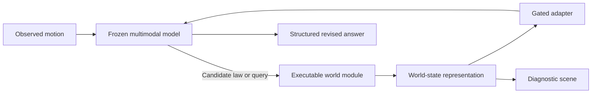
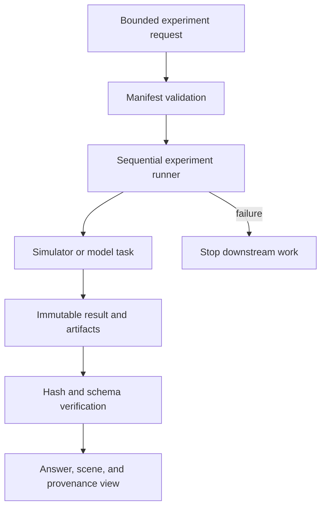

# JUMP Research

**Give an AI a theory. Let it run the thought experiment. Watch what happens when the world proves it wrong.**

JUMP gives a language model an executable physics sandbox it can use while reasoning. Instead of asking the model to imagine an unfamiliar dynamical system one token at a time, JUMP lets it test a candidate law, inspect the predicted consequence, compare that consequence with observation, and decide whether its explanation needs to change.

## Why JUMP

In the 2026 position paper [*LLMs can't jump*](https://philsci-archive.pitt.edu/28024/) ([PDF](https://philsci-archive.pitt.edu/28024/1/Scientific_Invention_Position_Paper%20%2817%29.pdf)), [Tom Zahavy](https://www.tomzahavy.com/projects/llms-cant-jump) distinguishes three forms of inference:

- **Induction:** infer a rule from observed cases.
- **Deduction:** derive consequences from a supplied rule.
- **Abduction:** propose a new explanatory premise for a surprising result.

Zahavy argues that current generative models are strong at induction and increasingly capable at deduction, but lack the mechanism for the abductive jump from experience to new premises. The paper suggests physically consistent, interactive world models as one possible scaffold for that jump.

JUMP turns one part of that proposal into a smaller empirical question:

> Can an executable counterfactual-world representation help a frozen multimodal language model recognize that a physical rule has failed and propose the correct hidden-variable replacement in a controlled synthetic world?

JUMP does not claim to refute the position paper or reproduce open-ended scientific invention. The synthetic setting is intentionally narrow so that competing explanations, interventions, and answers can be checked exactly.

## The thought experiment

One benchmark presents six identical dots moving on a 2D canvas. Each dot represents a test particle. The simulator secretly assigns every particle one of two types, but the model sees only positions and motion. Whether two particles attract or repel depends on whether their hidden types match; force strength follows a rule chosen from a small fixed family.

The model must:

1. commit to an explanation of the observed motion;
2. execute that explanation in the simulator;
3. notice when the simulated consequence conflicts with observation;
4. decide whether the old rule is noisy or structurally inadequate; and
5. return a structured replacement: the hidden grouping, force law, predicted forces, and confidence.

Six particles keep the scene readable while preserving a non-trivial inference problem. There are 31 distinct two-group assignments after treating a global swap of the type labels as the same answer. Because the simulator generated the world, JUMP can score the partition and law directly rather than asking another language model to judge the prose.

## What the product is designed to show

The bounded interface centers on three thought-experiment flows:

- **Falsified prior:** follow a prediction from commitment, through contradictory evidence, to a proposed replacement.
- **Hidden law discovery:** infer the unseen grouping and interaction law from motion.
- **Matched worlds:** compare worlds with the same visible setup but different hidden structure and consequences.

A live run is the primary path. The interface is designed to show the initial theory, observed and simulated motion, structured answer, scene, run identity, revisions, timing, and artifact provenance. If a live request fails, any recorded example must be offered only after the failure is shown and must be labeled as a recording—not silently substituted for a new run.

JUMP accepts only supported synthetic-dynamics experiments. It is not a general scientific assistant and is not intended for real-world scientific, medical, legal, financial, or safety decisions.

## Scientific design

The research path keeps the base language model frozen. An executable world module converts observed motion into a compact world-state representation, and a gated adapter supplies that state to the model. A decoder can turn the same state into a diagnostic scene for inspection.



The central counterfactual comparison uses two worlds with the same visible prefix, nuisance variables, candidate laws, and prompt length but different hidden partitions and future consequences. The model is evaluated with matched and control world states. This design asks whether the supplied representation changes the model's answer in the predicted direction; it does not assume that any change reveals a complete internal mechanism.

Answers follow an exact JSON contract covering the hidden partition, replacement law, adequacy decision, declared-horizon force vectors, and confidence. Planned controls include scrambled and random states, simulator output supplied as text, a same-parameter control, no-hidden-structure training, and permuted episode–state training.

## How to read the evidence

JUMP separates observable behavior from claims about mechanism:

- A correct answer shows benchmark performance in a specific tested setting.
- A matching hash shows that displayed bytes came from the sealed artifact it names.
- A decoded scene shows what a trained decoder can recover from a representation.
- A representation transplant shows that changing an input can change an answer.

None of these observations alone establishes that the model invented a scientific concept, that the decoded scene is its subjective imagery, or that one internal representation caused theory revision. Stronger claims require matched controls, necessity and sufficiency interventions, held-out law families, uncertainty estimates, and replication in a meaningfully different checkpoint.

**This repository does not claim a scientific result.** Its deterministic fixtures and synthetic mechanistic examples test software contracts and experiment plumbing.

## Architecture



| Path | Purpose |
|---|---|
| [`src/jump_runner/`](src/jump_runner/) | Manifest validation, sequential local or Modal execution, retry/resume, immutable attempts, and result verification |
| [`src/jump_mechanistic/`](src/jump_mechanistic/) | Activation, scoring, probing, swapping, intervention, bootstrap, and replication primitives |
| [`schemas/`](schemas/) | Versioned experiment-manifest and run-result contracts |
| [`examples/`](examples/) | Deterministic local smoke and synthetic mechanistic manifests |
| [`tests/`](tests/) | Contract, immutability, retry, secret-boundary, scoring, hardware, and integration tests |

Remote execution is sequential and fail-closed: a failed phase stops dependent work, completed runs are not repeated, and retries create new immutable attempts. Secrets are supplied out of band and must never be committed or printed.

## Run locally

Requirements: Python 3.10+ and a clean environment.

```bash
python -m venv .venv
source .venv/bin/activate
python -m pip install --upgrade pip
python -m pip install -e '.[test]'

pytest
jump-experiments plan examples/smoke-manifest.yaml --smoke
jump-experiments dry-run examples/smoke-manifest.yaml --smoke
jump-experiments run-local examples/smoke-manifest.yaml \
  --smoke --runs-dir /tmp/jump-runs
jump-experiments status examples/smoke-manifest.yaml \
  --smoke --runs-dir /tmp/jump-runs

jump-experiments run-local examples/mechanistic-synthetic.manifest.json \
  --smoke --runs-dir /tmp/jump-mechanistic
```

These commands use deterministic local fixtures and make no remote call. `run-local` refuses non-smoke execution. The synthetic mechanistic run verifies capture, scoring, probe, intervention, and result wiring; its metric values are not scientific evidence.

## Demo and artifacts

The public visual thought-experiment interface lives in `apps/web`. Model artifacts remain separate from the web deployment and are linked only after their identities, licenses, and end-to-end behavior have been verified.

Do not commit model weights, generated datasets, credentials, raw conversations, unrestricted logs, or third-party assets. Released artifacts must identify their base checkpoint, training objective, data provenance, limitations, hashes, and applicable license terms.

## Limitations

- The environment contains only six particles and a small force-law family; success may depend on task format or prompt cues.
- The simulator-text and latent-state interfaces are not perfectly representation-matched.
- Decoder accuracy is not proof that the frozen language model used the decoded feature.
- Probe decodability is correlational; causal and generality claims require separate tests.
- Synthetic dynamics do not establish transfer to real scientific discovery.
- The literature and citation audit is incomplete.

## Citation and license

The research prompt is:

> Tom Zahavy (2026), [*LLMs can't jump*](https://philsci-archive.pitt.edu/28024/), PhilSci-Archive preprint ([PDF](https://philsci-archive.pitt.edu/28024/1/Scientific_Invention_Position_Paper%20%2817%29.pdf)).

The citation motivates JUMP's empirical question; it does not imply endorsement by the paper's author.

This repository does not yet contain a `CITATION.cff`, DOI, tagged scientific release, or preferred project citation. It also does not contain a root `LICENSE` file. Until a license is added, all rights are reserved; do not assume permission to reuse or redistribute the code, data, fixtures, or documentation. Model-derived artifacts may also be subject to the terms of their base checkpoint.
